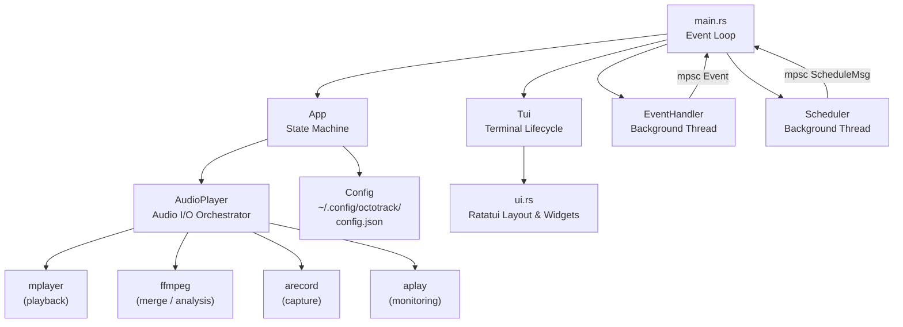
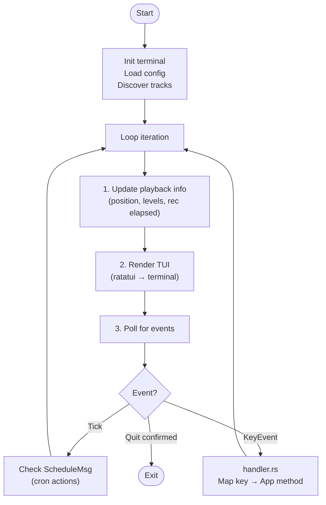
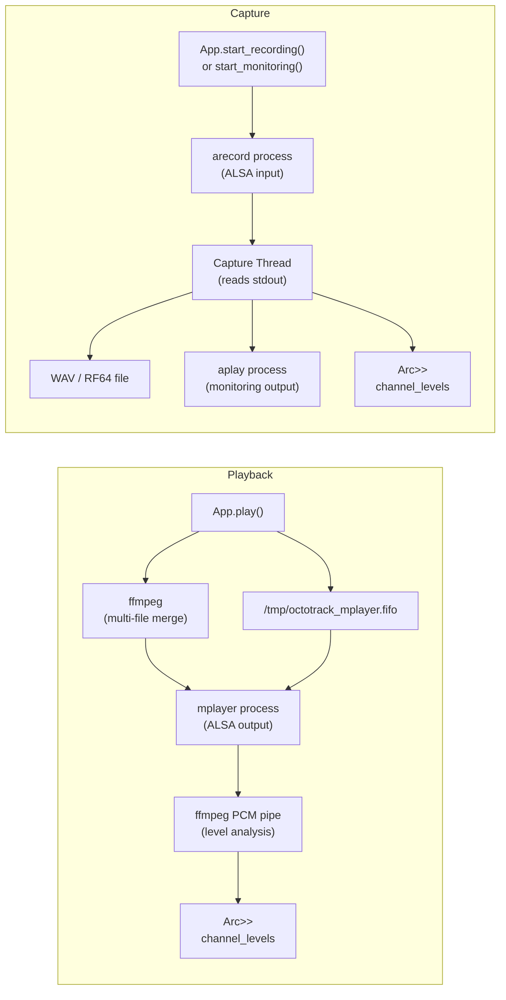
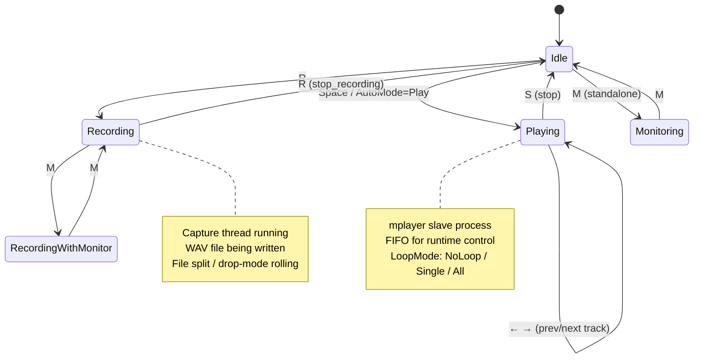
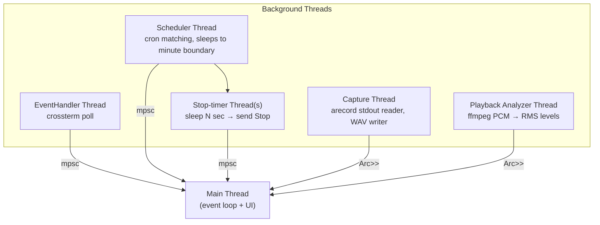
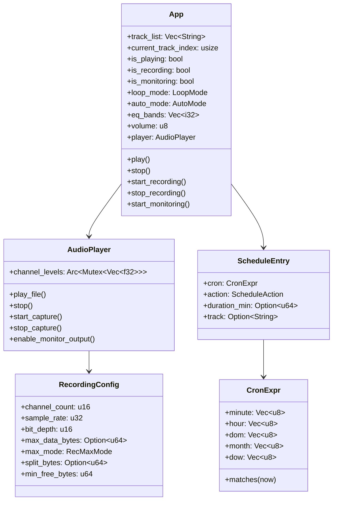

# Octotrack Architecture

## 1. High-Level Component Overview

---

## 2. Main Event Loop Flow

---

## 3. Audio Pipeline

---

## 4. App State Machine

---

## 5. Threading Model

---

## 6. Key Data Structures & Relationships

