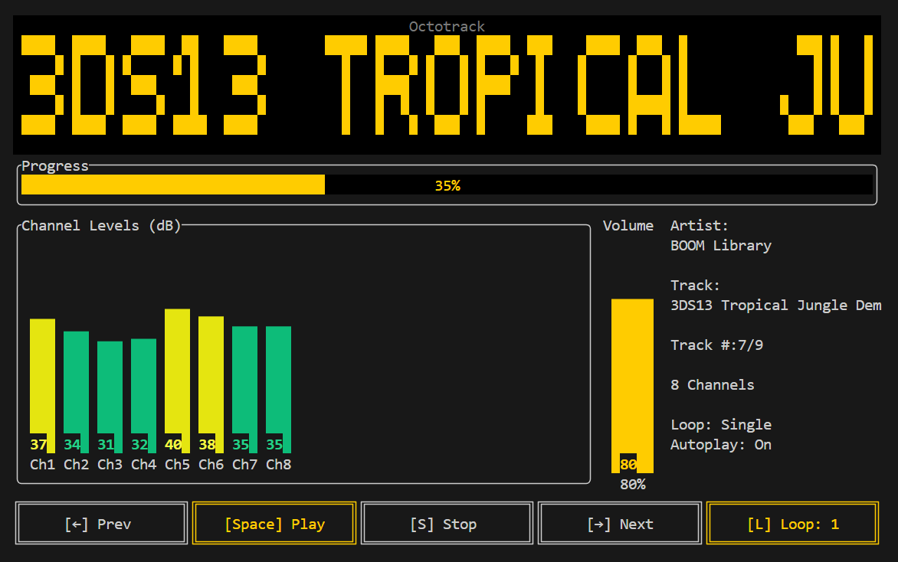

# Octotrack

A terminal-based multi-channel audio player built with Rust and Ratatui. Designed for playing back multi-track audio projects with real-time channel level metering and playback controls.



## Features

- Multi-channel audio playback (up to 8+ channels)
- Real-time per-channel level metering (dB)
- Support for single audio files or multi-file tracks (folders with multiple mono/stereo files)
- Loop modes: Off, Single, All
- Volume control with persistent settings
- 10-band graphic equalizer with bypass
- Autoplay mode for automatic playback on startup
- Track navigation (previous/next)
- Progress indicator with time display
- Metadata display (artist, title from file tags)
- Multi-channel recording via ALSA (configurable device, channel count, sample rate, bit depth)
- Configurable recording limits: stop at a file size, circular-buffer overwrite, or split into multiple files
- Dashcam mode: rolling file splits that delete the previous file, keeping only the current recording on disk
- Real-time input monitoring with level metering
- Configurable audio devices for playback, recording, and monitoring

## Platform Support

Octotrack is **Linux-only**. It relies on ALSA, mplayer, and ffmpeg, which are Linux-specific. macOS and Windows are not supported.

Pre-built binaries are available for arm64, armv7, armv6 (Pi Zero v1 W), and x86_64. See [docs/compatibility.md](docs/compatibility.md) for the full table.

## Installation

See [docs/installation.md](docs/installation.md).

## Usage

### Running the App

```bash
cargo run --release
```

Or run the compiled binary directly:

```bash
./target/release/octotrack
```

The app looks for a `tracks/` directory in the following order:

1. **USB storage** - scans `/media/` and `/mnt/` for any mounted drive containing a `tracks/` folder
2. **Local directory** - falls back to a `tracks/` folder in the current working directory

### Keyboard Controls

| Key | Action |
|-----|--------|
| `Space` | Play/Resume playback |
| `S` | Stop playback |
| `←` | Previous track |
| `→` | Next track |
| `↑` | Increase volume |
| `↓` | Decrease volume |
| `L` | Toggle loop mode (Off → Single → All) |
| `A` | Toggle autoplay on startup |
| `R` | Toggle recording |
| `M` | Toggle input monitoring |
| `E` | Open equalizer |
| `Q` or `ESC` | Quit (with confirmation dialog) |
| `Ctrl-C` | Quit (with confirmation dialog) |
| `Ctrl-S` | Save current settings to config file |

When the quit confirmation dialog appears:
- Press `Y` to confirm and quit
- Press `N` or `ESC` to cancel and return to the app

### Equalizer Controls

Press `E` to open the 10-band graphic equalizer overlay:

| Key | Action |
|-----|--------|
| `←` | Select previous band |
| `→` | Select next band |
| `↑` | Increase selected band (+1 dB) |
| `↓` | Decrease selected band (-1 dB) |
| `B` | Toggle EQ bypass (on/off) |
| `E` or `ESC` | Close equalizer |

EQ bands: 31Hz, 62Hz, 125Hz, 250Hz, 500Hz, 1kHz, 2kHz, 4kHz, 8kHz, 16kHz — each adjustable from -12 to +12 dB.

### Supported Audio Formats

- WAV (`.wav`)
- FLAC (`.flac`)
- MP3 (`.mp3`)

## Recording

Press `R` to start recording from the configured input device. Recordings are saved as WAV files in the current tracks directory.

- **Format:** configurable bit depth (16, 24, or 32-bit PCM) at a configurable sample rate
- **Channels:** set by `channel_count` under `[recording]` in the config
- **Filename:** `REC_<timestamp>.wav` — or `REC_<timestamp>_001.wav`, `_002.wav`, … when file splitting is enabled

Press `R` again to stop. The new recording appears in your track list automatically.

Press `M` to toggle input monitoring — this routes audio from the input device to the monitoring output in real-time with level metering, so you can hear what's coming in. Monitoring can be active independently or while recording.

**Crash protection:** Recordings are protected against crashes and power loss. The WAV header is flushed to disk every ~10 seconds during recording, so at most a few seconds of metadata is lost on an unexpected shutdown. Additionally, when you play a recording, the header is automatically checked and repaired if the file is larger than what the header claims — so a file left mid-recording will play back correctly with no manual intervention.

**Note:** Playback is automatically stopped when monitoring or recording starts, as the audio device may not support simultaneous playback and capture.

### Recording modes

Three settings work together to control what happens as a recording grows: `split_file_mb` sets the per-file size, `max_file_mode` controls what to do when limits are hit, and `max_file_mb` sets the total size cap. All three live under `[recording]` in `config.toml`.

#### Without splitting (`split_file_mb = 0`)

| `max_file_mode` | `max_file_mb` | Behaviour |
|---|---|---|
| `"stop"` | `0` | Record a single file until you press stop |
| `"stop"` | `4000` | Record a single file, stop automatically at 4000 MB |
| `"drop"` | `4000` | Circular buffer: keep recording forever into a single 4000 MB file, overwriting the oldest audio as new audio arrives |

#### With splitting (`split_file_mb = 3900`)

Files are named `REC_<timestamp>_001.wav`, `_002.wav`, … A new file is opened automatically each time the current one reaches `split_file_mb`.

| `max_file_mode` | `max_file_mb` | Behaviour |
|---|---|---|
| `"stop"` | `0` | Split into files ≤ 3900 MB, keep all of them, record until you press stop |
| `"stop"` | `20000` | Split into files ≤ 3900 MB, keep all of them, stop automatically once the total reaches 20000 MB |
| `"drop"` | `20000` | **Rolling window:** split into files ≤ 3900 MB and keep at most `20000 / 3900 ≈ 5` files on disk. When the 6th file starts, the 1st is deleted — the disk always holds ~20000 MB of the most recent audio |
| `"drop"` | `0` | Split into files ≤ 3900 MB, keep all of them indefinitely (same as `"stop"` with no limit) |

**Why use splitting?** Standard WAV has a 4 GB data limit per file. Splitting at 3900 MB keeps every file safely under that limit. It also protects against data loss from file corruption — if a file is damaged, only that segment is affected. RF64 is supported for single-file recordings that exceed 4 GB, but most DAWs handle split files more reliably.

**Rolling window use case:** A monitoring system that should run indefinitely without filling the disk. Set `split_file_mb` to a convenient chunk size (e.g. 3900 MB ≈ ~30 minutes at 8ch/192kHz/32bit), set `max_file_mb` to however much total disk you want to use, and set `max_file_mode` to `"drop"`. The recorder writes new files and deletes old ones automatically — you always have the most recent N minutes on disk.

## Configuration

Octotrack stores its configuration in `~/.config/octotrack/config.toml`. The file is created automatically on first run and updated via the keyboard. See [docs/configuration.md](docs/configuration.md) for the full reference including all settings, defaults, and how to find your ALSA device IDs.

## Scheduled Tasks

Octotrack can start and stop playback or recording on a cron-style schedule. See [docs/schedules.md](docs/schedules.md) for the schedule file format and cron expression reference.

## Preparing Multi-Channel Tracks

The `merge_tracks.sh` script combines multiple mono or stereo files into a single multi-channel file. See [docs/merge-tracks.md](docs/merge-tracks.md) for setup and usage.

## Raspberry Pi Setup

For running Octotrack on boot via systemd and configuring USB drive auto-mounting, see [docs/raspberry-pi.md](docs/raspberry-pi.md).

## Development

See [docs/development.md](docs/development.md) for project structure, running tests, and adding new features. See [docs/architecture.md](docs/architecture.md) for component diagrams and threading model.

## Troubleshooting

See [docs/troubleshooting.md](docs/troubleshooting.md).

## Support This Project

If you find Octotrack useful, the best way to support it is to star this repo and share it with others.

The biggest challenge for this project right now is **hardware access for testing**. We need to verify compatibility across a wider range of audio interfaces and create multi-channel demo content. If you have any of the hardware listed below and would be willing to loan or donate it for testing, please open an issue or reach out at jesse@jessestewart.com.

### Hardware needed for interface testing

- 8+ channel USB 3.0 audio interface (UAC class-compliant)
- 8 channel USB 2.0 audio interface (UAC class-compliant)
- RaspiAudio 8xIN 8xOUT HAT

### Hardware needed for demo content

To create 8-channel ORTF-3D surround field recordings (4.0 Lo + 4.0 Hi) for sample tracks and demo videos:

- 8x Sonorous Objects SO.4 or SO.104 ultrasonic omni microphones
- 8 channel discrete microphone preamp

## Author

**Jesse Stewart** — [GitHub](https://github.com/jesse-stewart) · [jesse@jessestewart.com](mailto:jesse@jessestewart.com)

## License

This project is licensed under the GNU General Public License v3.0. See [LICENSE](LICENSE) for details.
